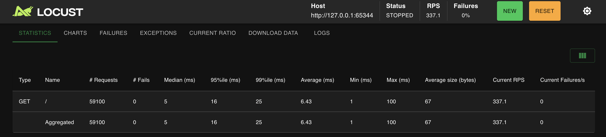
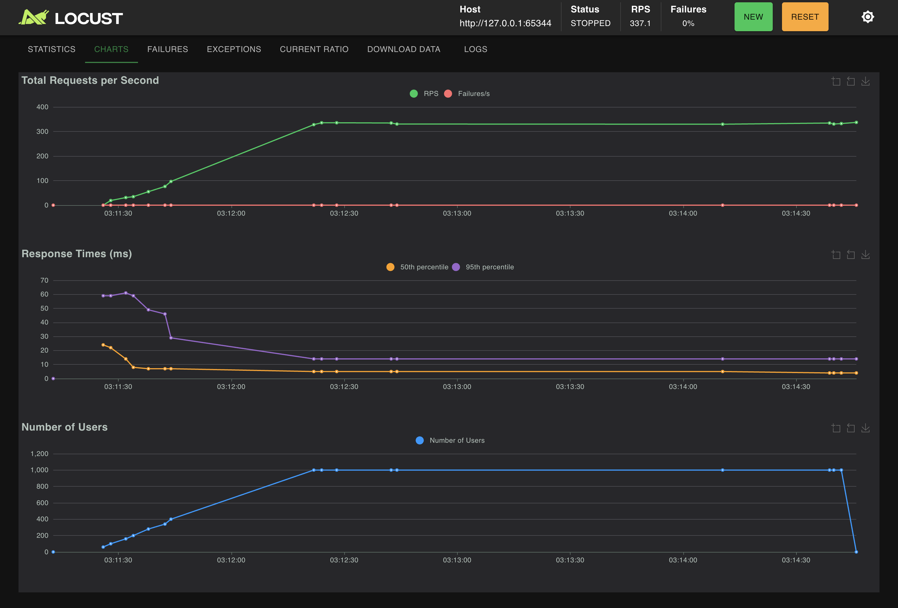
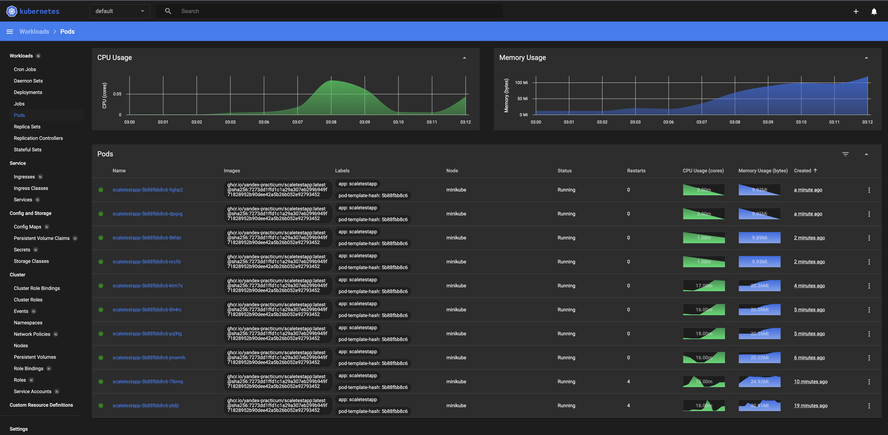
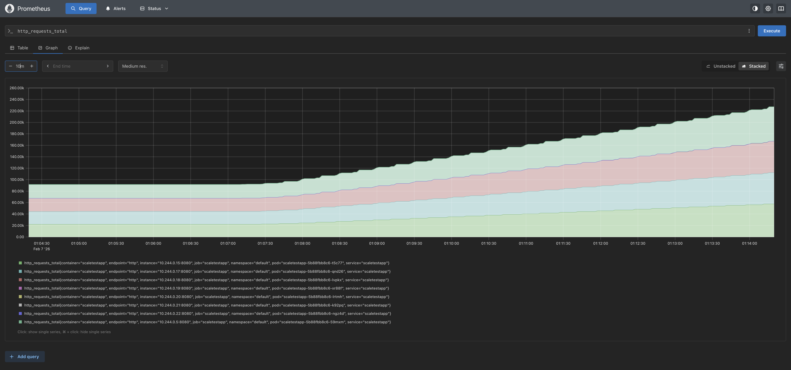
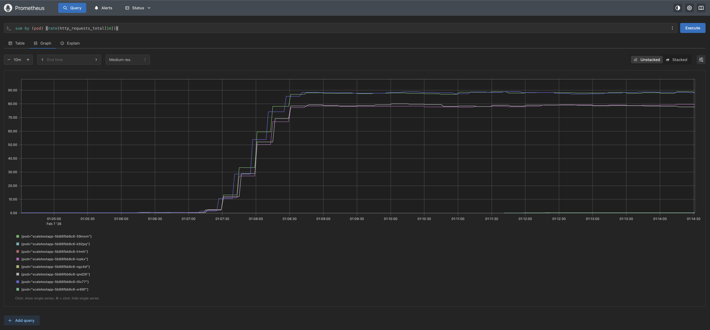
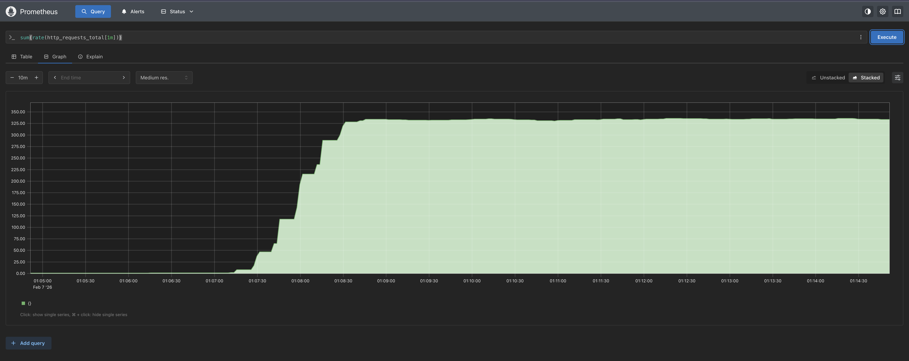
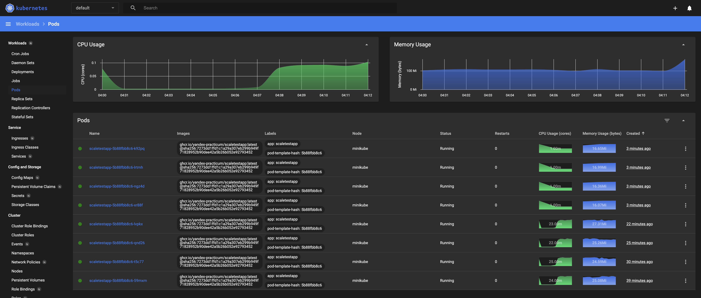

# Задание 2. Динамическое масштабирование контейнеров
## Часть 1. Динамическая маршрутизация на основании показателей утилизации памяти

### Запуск

Поднимаем миникуб
```commandline
minikube start --driver=docker --cpus=4 --memory=4096
```

Проверка запуска
```commandline
kubectl get nodes -o wide
```
Out:
```commandline
NAME       STATUS   ROLES           AGE   VERSION   INTERNAL-IP    EXTERNAL-IP   OS-IMAGE             KERNEL-VERSION     CONTAINER-RUNTIME
minikube   Ready    control-plane   27s   v1.34.0   192.168.49.2   <none>        Ubuntu 22.04.5 LTS   6.12.67-linuxkit   docker://28.4.0
```

Устанавливаем metrics-server

```commandline
minikube addons enable metrics-server
```

Проверяем
```commandline
kubectl -n kube-system get pods -l k8s-app=metrics-server
kubectl top nodes
kubectl top pods -A
```

Out:
```commandline
NAME                              READY   STATUS    RESTARTS   AGE
metrics-server-85b7d694d7-ph59b   1/1     Running   0          3m9s

NAME       CPU(cores)   CPU(%)   MEMORY(bytes)   MEMORY(%)   
minikube   142m         1%       654Mi           8%          

NAMESPACE     NAME                               CPU(cores)   MEMORY(bytes)   
kube-system   coredns-66bc5c9577-ws2bd           2m           17Mi            
kube-system   etcd-minikube                      22m          38Mi            
kube-system   kube-apiserver-minikube            39m          202Mi           
kube-system   kube-controller-manager-minikube   16m          56Mi            
kube-system   kube-proxy-vscqg                   1m           15Mi            
kube-system   kube-scheduler-minikube            9m           23Mi            
kube-system   metrics-server-85b7d694d7-ph59b    4m           21Mi            
kube-system   storage-provisioner                2m           11Mi       
```

Применяем deployment:
```commandline
kubectl apply -f deployment.yaml
```

Проверяем:
```commandline
kubectl rollout status deploy/scaletestapp
kubectl get pods -l app=scaletestapp -o wide
```

Out:
```commandline
deployment "scaletestapp" successfully rolled out

NAME                            READY   STATUS    RESTARTS   AGE   IP           NODE       NOMINATED NODE   READINESS GATES
scaletestapp-5b88fbb8c6-bs8qp   1/1     Running   0          92s   10.244.0.4   minikube   <none>           <none>
```

Применяем service:
```commandline
kubectl apply -f service.yaml
```
Проверяем:
```commandline
kubectl get svc scaletestapp
```
Out:
```commandline
NAME           TYPE        CLUSTER-IP    EXTERNAL-IP   PORT(S)    AGE
scaletestapp   ClusterIP   10.96.80.34   <none>        8080/TCP   3s
```

Выполняем `minikube service scaletestapp --url`, чтобы получить URL сервиса. Из output берём URL и тестируем эндпоинты
```commandline
URL={URL, полученный через команду выше}

curl -s "$URL/"
curl -s "$URL/metrics"
```

Далее применяем HPA:
```commandline
kubectl apply -f hpa.yaml
```
Проверяем:
```commandline
kubectl get hpa scaletestapp-hpa
kubectl describe hpa scaletestapp
kubectl top pods -l app=scaletestapp
```
Out:
```commandline
NAME               REFERENCE                 TARGETS           MINPODS   MAXPODS   REPLICAS   AGE
scaletestapp-hpa   Deployment/scaletestapp   memory: 61%/80%   1         10        1          100s


Name:                                                     scaletestapp-hpa
Namespace:                                                default
Labels:                                                   <none>
Annotations:                                              <none>
CreationTimestamp:                                        Sat, 07 Feb 2026 00:02:07 +0300
Reference:                                                Deployment/scaletestapp
Metrics:                                                  ( current / target )
  resource memory on pods  (as a percentage of request):  61% (12576Ki) / 80%
Min replicas:                                             1
Max replicas:                                             10
Deployment pods:                                          1 current / 1 desired
Conditions:
  Type            Status  Reason              Message
  ----            ------  ------              -------
  AbleToScale     True    ReadyForNewScale    recommended size matches current size
  ScalingActive   True    ValidMetricFound    the HPA was able to successfully calculate a replica count from memory resource utilization (percentage of request)
  ScalingLimited  False   DesiredWithinRange  the desired count is within the acceptable range
Events:           <none>


NAME                            CPU(cores)   MEMORY(bytes)   
scaletestapp-5b88fbb8c6-bs8qp   1m           12Mi            
```

### Результат






## Часть 2. Динамическая маршрутизация на основании показателей количества запросов в секунду

### Запуск

Установка Prometheus
```commandline
helm repo add prometheus-community https://prometheus-community.github.io/helm-charts
helm repo update
kubectl create namespace monitoring
helm install kps prometheus-community/kube-prometheus-stack --namespace monitoring
```
Проверка:
```commandline
kubectl -n monitoring get pods
kubectl -n monitoring get svc | head
```
Out:
```commandline
NAME                                                    READY   STATUS    RESTARTS   AGE
alertmanager-kps-kube-prometheus-stack-alertmanager-0   2/2     Running   0          65s
kps-grafana-65cdf7f6fd-d45s5                            3/3     Running   0          86s
kps-kube-prometheus-stack-operator-6f54bd59f7-47ntr     1/1     Running   0          86s
kps-kube-state-metrics-6654c4b6b4-pmz95                 1/1     Running   0          86s
kps-prometheus-node-exporter-wncrg                      1/1     Running   0          86s
prometheus-kps-kube-prometheus-stack-prometheus-0       2/2     Running   0          65s


NAME                                     TYPE        CLUSTER-IP       EXTERNAL-IP   PORT(S)                      AGE
alertmanager-operated                    ClusterIP   None             <none>        9093/TCP,9094/TCP,9094/UDP   65s
kps-grafana                              ClusterIP   10.102.163.56    <none>        80/TCP                       86s
kps-kube-prometheus-stack-alertmanager   ClusterIP   10.101.243.248   <none>        9093/TCP,8080/TCP            86s
kps-kube-prometheus-stack-operator       ClusterIP   10.97.236.4      <none>        443/TCP                      86s
kps-kube-prometheus-stack-prometheus     ClusterIP   10.101.37.174    <none>        9090/TCP,8080/TCP            86s
kps-kube-state-metrics                   ClusterIP   10.106.213.70    <none>        8080/TCP                     86s
kps-prometheus-node-exporter             ClusterIP   10.107.133.99    <none>        9100/TCP                     86s
prometheus-operated                      ClusterIP   None             <none>        9090/TCP                     65s
```

Применяем servicemonitor:
```commandline
kubectl apply -f servicemonitor.yaml
```
Проверка:
```commandline
kubectl -n monitoring get servicemonitor
```
Out:
```commandline
NAME                                                AGE
kps-grafana                                         7m55s
kps-kube-prometheus-stack-alertmanager              7m55s
kps-kube-prometheus-stack-apiserver                 7m55s
kps-kube-prometheus-stack-coredns                   7m55s
kps-kube-prometheus-stack-kube-controller-manager   7m55s
kps-kube-prometheus-stack-kube-etcd                 7m55s
kps-kube-prometheus-stack-kube-proxy                7m55s
kps-kube-prometheus-stack-kube-scheduler            7m55s
kps-kube-prometheus-stack-kubelet                   7m55s
kps-kube-prometheus-stack-operator                  7m55s
kps-kube-prometheus-stack-prometheus                7m55s
kps-kube-state-metrics                              7m55s
kps-prometheus-node-exporter                        7m55s
scaletestapp                                        31s
```


Запуск UI:
```commandline
kubectl -n monitoring port-forward svc/kps-kube-prometheus-stack-prometheus 9090:9090
```

Открываем http://localhost:9090 > Status > Targets > scaletestapp > должен быть UP
Graph > `http_requests_total` > Метрика есть > Просмотреть суммы прироста по подам `sum by (pod) (rate(http_requests_total[1m]))`


Устанавливаем adapter для HPA через RPS
```commandline
helm install prom-adapter prometheus-community/prometheus-adapter --namespace monitoring -f prometheus-adapter-values.yaml
```
Проверяем:
```commandline
kubectl get apiservices | grep custom.metrics
kubectl get --raw "/apis/custom.metrics.k8s.io/v1beta1" | head
kubectl get --raw "/apis/custom.metrics.k8s.io/v1beta1/namespaces/default/pods/*/rps_per_pod" | head
```
Out:
```commandline
v1beta1.custom.metrics.k8s.io     monitoring/prom-adapter-prometheus-adapter   True        95s


{"kind":"APIResourceList","apiVersion":"v1","groupVersion":"custom.metrics.k8s.io/v1beta1","resources":[{"name":"namespaces/rps_per_pod","singularName":"","namespaced":false,"kind":"MetricValueList","verbs":["get"]},{"name":"pods/rps_per_pod","singularName":"","namespaced":true,"kind":"MetricValueList","verbs":["get"]}]}


{"kind":"MetricValueList","apiVersion":"custom.metrics.k8s.io/v1beta1","metadata":{},"items":[{"describedObject":{"kind":"Pod","namespace":"default","name":"scaletestapp-5b88fbb8c6-59mxm","apiVersion":"/v1"},"metricName":"rps_per_pod","timestamp":"2026-02-07T00:47:28Z","value":"311m","selector":null},{"describedObject":{"kind":"Pod","namespace":"default","name":"scaletestapp-5b88fbb8c6-t5c77","apiVersion":"/v1"},"metricName":"rps_per_pod","timestamp":"2026-02-07T00:47:28Z","value":"311m","selector":null}]}
```

Применяем hpa-rps:
```commandline
kubectl apply -f hpa-rps.yaml
```
Проверяем:
```commandline
kubectl get hpa scaletestapp-hpa-rps
kubectl describe hpa scaletestapp-hpa-rps
```
Out:
```commandline
NAME                   REFERENCE                 TARGETS          MINPODS   MAXPODS   REPLICAS   AGE
scaletestapp-hpa-rps   Deployment/scaletestapp   <unknown>/500m   1         10        4          44s


Name:                                  scaletestapp-hpa-rps
Namespace:                             default
Labels:                                app=scaletestapp
Annotations:                           <none>
CreationTimestamp:                     Sat, 07 Feb 2026 03:51:31 +0300
Reference:                             Deployment/scaletestapp
Metrics:                               ( current / target )
  "http_requests_per_second" on pods:  <unknown> / 500m
Min replicas:                          1
Max replicas:                          10
Behavior:
  Scale Up:
    Stabilization Window: 15 seconds
    Select Policy: Max
    Policies:
      - Type: Percent  Value: 100  Period: 3 seconds
  Scale Down:
    Stabilization Window: 100 seconds
    Select Policy: Max
    Policies:
      - Type: Percent  Value: 10  Period: 25 seconds
Deployment pods:       4 current / 0 desired
Conditions:
  Type           Status  Reason             Message
  ----           ------  ------             -------
  AbleToScale    True    SucceededGetScale  the HPA controller was able to get the target's current scale
  ScalingActive  False   AmbiguousSelector  pods by selector app=scaletestapp are controlled by multiple HPAs: [default/scaletestapp-hpa default/scaletestapp-hpa-rps]
Events:
  Type     Reason                        Age                From                       Message
  ----     ------                        ----               ----                       -------
  Warning  AmbiguousSelector             14s (x2 over 29s)  horizontal-pod-autoscaler  pods by selector app=scaletestapp are controlled by multiple HPAs: [default/scaletestapp-hpa default/scaletestapp-hpa-rps]
  Warning  FailedComputeMetricsReplicas  14s (x2 over 29s)  horizontal-pod-autoscaler  pods by selector app=scaletestapp are controlled by multiple HPAs: [default/scaletestapp-hpa default/scaletestapp-hpa-rps]
```

Смотрим в UI: `sum(rate(http_requests_total[1m]))`, `sum by (pod) (rate(http_requests_total[1m]))`, `http_requests_total` (убедиться, что запросы доходят)

### Результат





