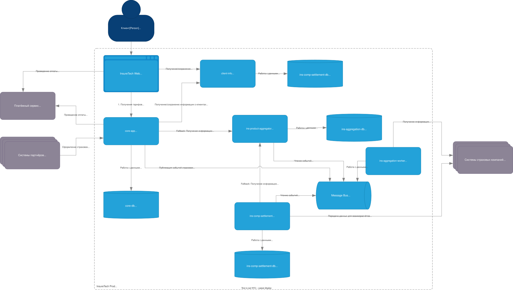

# Задание 3. Переход на Event-Driven архитектуру

## Проблемы и риски текущей архитектуры

### 1. Синхронная агрегация продуктов через ins-product-aggregator

Проблемы:
- ins-product-aggregator при каждом запросе ходит во все страховые компании и агрегирует ответ в рантайме.
- задержки и ошибка любой страховой компании ухудшает латентность и скорость ответа.
- нет fallback-механизма при проблемах с частью партнёров.
- одни и те же данные пересчитываются многократно при каждом опросе.

Риски при росте с 5 до 10 страховых компаний:
- рост времени ответа и вероятности ошибки.
- ухудшение SLA сервисов core-app и ins-comp-settlement из-за роста времени/ошибок агрегатора.

### 2. Polling-обновления локальных реплик данных (core-app раз в 15 минут, ins-comp-settlement раз в сутки)
Проблемы:
- данные могут устаревать, приводя к неконсистентности между сервисами.
- сервисы единовременно создают скачок нагрузки, например, ночью.
- трудно диагностировать, почему реплика не обновилась.

Риски при росте нагрузки:
- увеличение частоты ошибок.
- пользователи или партнёры могут видеть разные наборы продуктов в разных частях системы.

### 3. Синхронная связка ins-comp-settlement с core-app (получение оформленных страховок за день)
Проблемы
- settlement зависимо от доступности core-app в момент ночного расчёта.
- при сбоях или ретраях сложно гарантировать однократную и полную выгрузку за день.
- ночной пакетный экспорт может создавать лишнюю нагрузку в ночное время.

Риски при росте объёма оформлений:
- увеличение объёма запроса может приводить к таймаутам.
- увеличение нагрузки на core-app может приводить к его деградации.

### 4. Общие системные риски (связанные с синхронными интеграциями)
- таймауты и ретраи могут распространяться каскадно по сервисам.
- при деградации внешних API система продолжает обращаться к ним синхронно (отсуствует backpressure).
- ошибки размазаны по цепочке вызовов; сложно определить первопричину.
- каждая новая интеграция с партнёром увеличивает синхронную критичность компонентов.

## Предлагаемые решения
Не меняя границы сервисов, ключевые синхронные взаимодействия следует заменить на Event-Streaming:

1. `ins-product-aggregator` перестаёт ходить во внешние сервисы напрямую по запросу. Вместо этого:
   - `ins-aggregation-worker` периодически или по триггеру получает обновления от страховых компаний и публикует события об изменениях продуктов и тарифов в поток событий;
   - `ins-aggregation-consumer` читает события и сохраняет данные в БД;
   - `ins-product-aggregator` выступает в качестве внутреннего Read API с хранилищем результатов обновлений.

2. `core-app` и `ins-comp-settlement` перестают поллить `ins-product-aggregator`. Вместо этого:
   - Они подписываются на поток событий продуктов и тарифов и обновляют свои локальные реплики по событиям.
   - На случай неконсистентности данных - запрашивают данные у `ins-product-aggregator` как fallback-механизм.

3. `core-app` перестаёт отдавать `ins-comp-settlement` списки оформленных за день страховок синхронно. Вместо этого:
   - `core-app` публикует события о создании или изменении; 
   - `ins-comp-settlement` читает события и строит из них реестр.

4. Так же нужно использовать Transactional Outbox: события должны публиковаться надёжно и согласованно с изменениями в БД. Без outbox есть риск потери событий (во время сбоев при отправке и чтении).
   - `core-app`: при изменениях страховок, полисов, заявок.
   - `ins-product-aggregator`: при изменениях агрегированного каталога, тарифов.

## Схема

