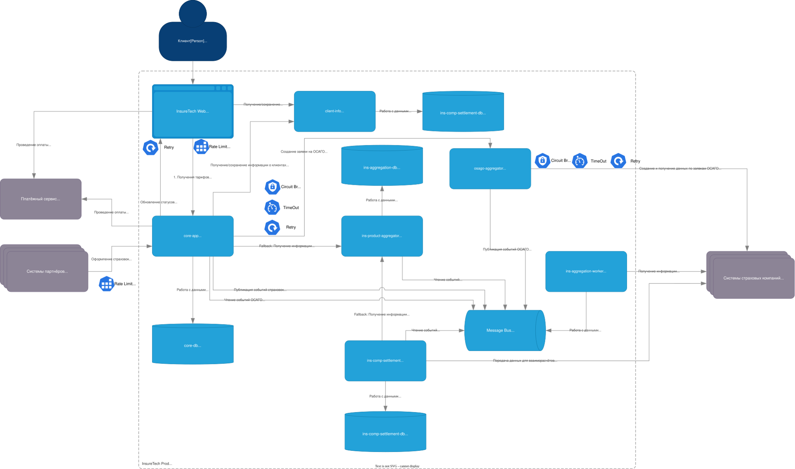

# Задание 4. Проектирование продажи ОСАГО

## Хранилище для osago-aggregator
Хранилище для сервиса osago-aggregator нужно.

1. Хранить корелляцию и состояние заявки: для каждой user-заявки нужно хранить:
   - `osago_request_id` (внутренний);
   - список страховых, `status` по каждой;
   - внешние `application_id` страховых;
   - полученные предложения.
2. Идемпотентность:
   - повторный запрос пользователя или отправка из-за сетевого сбоя не должны создавать дубли.
3. Горизонтальное масштабирование и сохранение состояний:
   - любой инстанс агрегатора должен уметь продолжить обработку по записи из БД.
4. Аудит и повторная выдача результатов:
   - core-app может повторно запросить состояние и результаты без переопроса страховых.

## API osago-aggregator'а
Для создания заявки использовать синхронный API (для мгновенной фиксации заявки через UI), для отслеживания статуса - асинхронный + синхронный GET.

### 1. Синхронный endpoint создания заявки
- `POST /osago/requests`
  - вход: данные авто, водителей, параметры
  - выход: `osago_request_id` + список страховых

### 2. Получение текущего состояния
- `GET /osago/requests/{id}`
  - отдаёт агрегированную картину по всем страховым (для восстановления UI, рефреша страницы).

### 3. Результат выполнения
`osago-aggregator` передаёт `core-app` результаты асинхронно через event streaming.

## Средство интеграции core-app с osago-aggregator
Event-Streaming через Kafka и минимальный REST.

1) `core-app` > `osago-aggregator`:
   - `POST /osago/requests` > отправка события `RequestCreated` в брокер.
2) `osago-aggregator` > `core-app`:
   - события в брокер:
     - `OfferReceived` - получен ответ от страховой
     - `OfferFailed` - ошибка/таймаут
     - `OffersCollected` - ответы от всех страховых обработаны

### Transactional Outbox
- запись статуса или предложения в БД и публикация события должны быть согласованы.

## API для приложения core-app
Нужен realtime-канал.

### 1. Синхронный endpoint создания заявки
- `POST /osago/requests`
  - вход: данные авто, водителей, параметры
  - выход: `osago_request_id` + список страховых

### 2. Получение текущего состояния
- `GET /osago/requests/{id}`
  - отдаёт агрегированную картину по всем страховым (для восстановления UI, рефреша страницы).

### 3. Realtime для поступающих предложений
Выбор: SSE (Server-Sent Events) как наиболее простой и устойчивый вариант.
- `GET /api/osago/requests/{id}/stream` (SSE)
  - core-app отправляет события по мере получения `OfferReceived` из брокера

### 4. REST для восстановления состояния
- `GET /api/osago/requests/{id}` - возвращает уже полученные предложения + статусы.

## Средство интеграции Web с core-app
- REST + SSE для обновления статуса по каждой страховой 

## Паттерны отказоустойчивости

1. На входе (B2C и B2B): Rate Limiting - для защиты от всплесков, стабилизации очередей и внешних интеграций
2. `core-app` > `osago-aggregator` (внутренний вызов старта):
   - `Timeout` - 1-2 секунды;
   - `Retry` - 1-2 раза с jitter только на сетевые ошибки;
   - `Circuit Breaker` - для быстрой отдачи ошибки при деградации;
3. `osago-aggregator` > страховые компании:
   - `Timeout` - на каждый HTTP вызов до 5 сек, 60 сек на опрос.
   - `Retry` - только на безопасных/идемпотентных операциях (создание только с ключем идемпотентности, чтобы избежать дублей)
   - `Circuit Breaker` на каждую каждой страховую в качестве изоляции (если легла одна страховая, весь аггрегатор не должен лечь)

4. Event streaming (Kafka)
   - идемпотентность потребления по `event_id` / `request_id`.

## Схема

